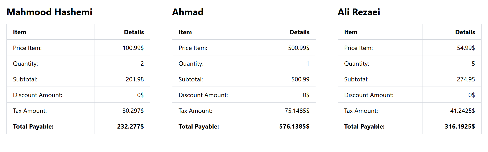

# Assignment Instructions: Order Processing System

## Exercise 1: Basic PHP Script
Write a PHP script that displays "Hello World" in the browser.

---

## Exercise 2: Order Processing System

### Task 1: Define Variables and Constants
- **Variables:**
    - `$customerName`: Stores the customer's name (string).
    - `$price`: Stores the product price (float).
    - `$quantity`: Stores the quantity of the product (integer).
    - `$discountApplied`: Indicates whether a discount is applied (boolean).
- **Constants:**
    - `TAX_RATE`: Represents the tax rate (e.g., 0.15).
    - `DISCOUNT_RATE`: Stores the discount value (float).
    - `STANDARD_SHIPPING`: Stores the shipping cost.

### Task 2: Add Comments
- Include comments explaining:
    - Variable declarations.
    - Conditions.
    - Output formatting.

### Task 3: Calculate Total Cost
- Compute the subtotal and store it in `$subtotal`.
- Compute the total cost including tax and store it in `$total`.

### Task 4: Apply Conditional Logic
- **Conditions:**
    - If `$total > 100` and `$total < 1000`:
        - Display a green `<p>` message: "Your order qualifies for free shipping."
        - Set `$discountApplied` to `false`.
    - If `$total >= 1000`:
        - Display the same green `<p>` message.
        - Apply the discount to the total and set `$discountApplied` to `true`.
        - If `$discountApplied` is `true`, display a bold `<strong>` message: "Discount applied: [discount]".
    - If `$total` is between 50 and 100:
        - Display a blue `<p>` message: "Standard shipping cost is [shipping]".
    - If `$total < 50`:
        - Display an orange `<p>` message: "Your order is not eligible for shipping."

### Task 5: Display Output
- Use HTML tags (`<h3>`, `<p>`, `<strong>`) to format the output.

---

## Exercise 3: Refactor into Functions

Convert the script from Exercise 2 into a structured PHP application using functions. Implement the following functions:
- `calculateSubTotal(float $price, int $quantity): float`
- `calculateTax(float $amount): float`
- `calculateDiscount(float $amount, &$discount_applied): float`
- `calculatePayable(float $subtotal): float`
- `calculateShipping(float $amount): ?float`
- `processSingleOrder(string $customerName, float $price, int $quantity): array`

### Function Output
The `processSingleOrder` function should return an associative array with the following structure:
```php
[
        'customer'          => string,
        'price'             => float,
        'quantity'          => int,
        'subtotal'          => float,
        'payable'           => float,
        'discount_amount'   => float,
        'discount_applied'  => boolean,
        'tax_amount'        => float,
        'shipping_cost'     => float
]
```

---

## Exercise 4: Handle Multiple Orders

### Task 1: Process Multiple Orders
Write a function `processOrders(array $orders): array` to handle an array of orders. The input `$orders` array should have the following structure:
```php
$orders = [
        [
                'order_id' => 1001,
                'customer' => 'John Doe',
                'product_name' => 'Smartphone 128GB',
                'price' => 24.99,
                'quantity' => 2
        ],
        [
                'order_id' => 1002,
                'customer' => 'Jane Smith',
                'product_name' => 'Smartphone 256GB',
                'price' => 49.50,
                'quantity' => 80
        ]
];
```

### Task 2: Function Output
The `processOrders` function should return an array with the following structure:
```php
array(2) {
    [0]=>
    array(11) {
        ["order_id"]=>
        int(1001)
        ["customer"]=>
        string(8) "John Doe"
        ["product_name"]=>
        string(16) "Smartphone 128GB"
        ["price"]=>
        float(24.99)
        ["quantity"]=>
        int(2)
        ["subtotal"]=>
        float(49.98)
        ["payable"]=>
        float(57.477)
        ["discount_amount"]=>
        float(0)
        ["discount_applied"]=>
        NULL
        ["tax_amount"]=>
        float(7.497)
        ["shipping_cost"]=>
        float(8.99)
    }
    [1]=>
    array(11) {
        ["order_id"]=>
        int(1002)
        ["customer"]=>
        string(10) "Jane Smith"
        ["product_name"]=>
        string(16) "Smartphone 256GB"
        ["price"]=>
        float(49.5)
        ["quantity"]=>
        int(80)
        ["subtotal"]=>
        float(3960)
        ["payable"]=>
        float(4098.6)
        ["discount_amount"]=>
        float(396)
        ["discount_applied"]=>
        bool(true)
        ["tax_amount"]=>
        float(594)
        ["shipping_cost"]=>
        float(0)
    }
}
```

---

### Output Example

